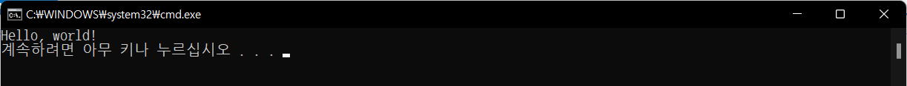

# Hello, world!

Hello, world!를 콘솔에 출력하는 프로그램은 1978년 브라이언 커니핸과 데니스 리치가 쓴 'The C Programming Language'라는 책에서 첫 번째 예제 프로그램에서 비롯합니다.

최초에는 쉼표나 느낌표가 없었는데 다른 언어에서 사용하며 조금씩 변하여 위와 같이 되었습니다. 때로는 자신의 언어에 맞게 Hello, python이나 Java 처럼 하는 경우도 있으나, Hello world를 디스플레이하는 게 대부분의 언어에서 첫번째 프로그램으로 사용하는 암묵적인 룰로 굳어졌습니다.

C# Hello world 프로젝트를 시작해봅니다. 아래는 수행 순서입니다.

1. Visual Studio 2022 실행
2. 새 프로젝트 만들기 버튼 클릭
3. 콘솔 앱(.NET Framework) 선택
4. 프로젝트 이름 'ex01\_Hello\_world' 입력&#x20;
5. 위치는 특정 위치 지
6. 솔루션 이름 'csharpBasic' 입력 후 다음 클릭
7. 만들기 클릭
8. Program.cs 소스 클릭
9. Main 아래의 빈 영역에 아래의 소스에서 Console... 부분만 입력
10. 솔루션 빌드 수행
11. 디버그하지 않고 시작 클릭
12. 결과 확인

아래는 실행결과입니다.

<figure><figcaption><p>execution result</p></figcaption></figure>

아래는 최종 전체 소스입니다. C#의 소스 파일은 .cs라는 확장자로 구분하며, 모든 콘솔의 기본 소스파일은  Program.cs 입니다. 이름을 변경해도 무방하나 보통은 손을 대지 않는 것을 추천합니다.

```csharp
using System;

// Hello world 프로그램
namespace ex01_Hello_world
{
    internal class Program
    {
        static void Main(string[] args)
        {
            Console.WriteLine("Hello, world!");
        }
    }
}
```

### 소스 분석

위의 소스를 하나씩 설명합니다.

1. using System; \
   System이라는 라이브러리를 사용하겠다는 전처리 명령입니다. 이 부분이 없다면 아래의 Console.WriteLine()은 System.Console.WriteLine() 이라고 작성해야 합니다. 한마디로 소스코드에서 사용하고자 하는 기능을 사용한다는 것을 사전에 지정하는 부분입니다. 실무 소스로 갈 수록 using 부분이 수십 라인으로 늘어납니다.
2. // ...\
   주석입니다. 소스 코드 내에 메모를 기록하기 위한 영역입니다. 컴파일러가 컴파일(솔루션 빌드) 할 때 아무런 영향을 미치지 않는 부분입니다. 일기를 써도 무방합니다.
3. namespace ex01...\
   네임스페이스는 프로젝트를 수행하는 영역(한 가족이 사는 집과 같음)을 구성 - 그룹화 - 하는 단위입니다. namespace 내에는 하나의 cs 파일만 존재할 수도 여러개의 cs 파일이 존재할 수도 있습니다. 이러한 다중 파일 구성에 필요한 것이 바로 namespace 입니다. 하나의 네임스페이스 여러 파일들이 구조를 이루어 나중에 사용할 수 있습니다.
4. { ... }\
   중괄호라고 부르며 일련의 코드 블럭을 구분하는 구분자입니다. 이 중괄호 내에 있는 코드는 모두 같은 레벨에서 동작합니다.&#x20;
5. internal \
   public, private, protected 와 같은 접근 제한자(Access Modifier) 입니다. public은 공개로 누구나 접근 가능하다이고, internal은 내부에서는 접근이 가능하다는 보안적인 의미라고 보면 됩니다. 나중에 다시 학습하게 됩니다.
6. class Program\
   클래스는 객체지향 언어에서 프로그램을 구성하는 기본 단위입니다. 제일 중요한 단위죠.
7. static void Main(...)\
   메서드를 말합니다. static은 정적이라는 의미로 콘솔 프로그램에서만 나오는 개념입니다. 일단은 메모리 정적인 영역에 올라간다는 뜻으로 알고 있으면 됩니다.
8. void\
   값을 돌려주지 않는다는 의미입니다. int라고 되어 있다면 마지막에 메서드를 호출한 쪽  int값을 되돌려줘야 한다는 의미입니다.
9. Main\
   메인 엔트리 메서드를 뜻합니다. 메인 엔트리란 처름 프로그램을 시작할때의 진입점을 말하여 모든 프로그램에 하나만 존재합니다.
10. string\[] args\
    메서드 파라미터라고 부릅니다. 콘솔에서 명령어를 입력할 때 명령어 뒤에 붙는 메시지를 처리하기 위한 영역입니다. args의 타입은 문자열 배열이라는 의미입니다.
11. Console.WriteLine("Hello, world!")\
    콘솔에 Hello, world!라는 문자열을 출력하라는 명령입니다.
12. ;\
    모든 문장의 끝을 표시해주는 부분으로, semi colon으로 부르며 이 부분이 없으면 오류가 발생합니다.
