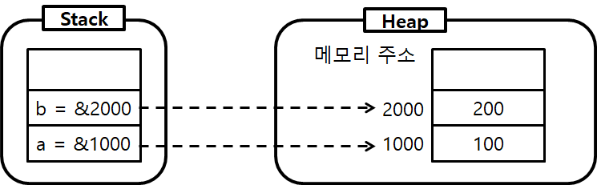

# 변수와 데이터타입

컴퓨팅을 할 때는 중간에 데이터를 저장하고 있어야 다음 일을 진행할 수 있습니다. 이 중간데 데이터를 저장하는 장소를 변수(!)라고 부르고 있습니다. 그리고, 이를 저장할 때 저장하는 종류마다 다른 형태로 담게 되는데 이를 데이터타입(형)이라고 부릅니다.

### 데이터의 변화

컴퓨터는 최초에 계산 기계로 시작했습니다. 에니악은 대포 탄도계산을 위한 목적을 가지고 있었습니다. 이때는 수학적인 데이터만 담으면 되겠죠. 이러한 계산에 대한 처리만을 할 수 있던 기계에서 현대적인 범용적 컴퓨팅 기계로 변하기 위해서는 여러가지 데이터를 담을 수 있도록 되야 됐습니다.

### 데이터 형식 종류

데이터의 형식은 아래와 같습니다.

* 기본 형식
* 상수, 열거형
* 복합형 - 구조체, 배열, 클래스

그리고 어떠한 형태로 저장할것인가에 따라 값 형식, 참조 형식으로 나눌 수 있습니다.

#### 값형식

<figure><figcaption></figcaption></figure>

#### 참조형식

<figure><figcaption></figcaption></figure>

### 변수

변수란 데이터를 담을 수 있는 상자라고 생각하시면 됩니다만, '데이터를 저장하기 위해 프로그램에 의해 이름을 배정받은 메모리 공간'을 의미합니다.

만약 그냥 값을 담는다는 의미만 있다면 값 또는 수라고 불렀겠지만, 변수(變數 : 변하는 수)라는 이름도 담겨 있는 값이 변할 수 있다는 의미이기 때문에 붙여진 이름입니다. 영어로 variable(변화를 줄 수 있는)이라고 부르는 이유도 이 때문입니다. 반대의 의미가 상수(constant)가 있죠. 우리가 잘 아는 상수 중 하나가 바로 pi = 3.141592 입니다.

소스코드로 볼 때는 값을 대입시켜 변화시킬 수 있는 요소를 변수라고 합니다.

| 형식명     | 설명       | 크기(8bit) | 범위                                                      |
| ------- | -------- | -------- | ------------------------------------------------------- |
| byte    | unsigned | 1byte    | 0 \~ 255                                                |
| sbyte   | 부호정수     | 1byte    | -128 \~ 127                                             |
| short   | 정수       | 2bytes   | -32,768 \~ 32,767                                       |
| ushort  | unsigned | 2bytes   | 0 \~ 65,535                                             |
| int     | 정수       | 4bytes   | -2,147,483,648 \~ 2,147,483,647                         |
| uint    | unsigned | 4bytes   | 0 \~ 4,294,967,295                                      |
| long    |          | 8bytes   | -9,223,372,036,854,775,808 \~ 9,223,372,036,854,775,807 |
| ulong   | unsigned | 8bytes   | 0 \~ 18,446,744,073,709,551,615                         |
| char    |          | 2bytes   | U + 0000 \~ U + ffff                                    |
| float   |          | 4bytes   | ±1.5e-45 \~ ±3.4e38                                     |
| double  |          | 8bytes   | ±5.0e-324 \~ ±1.7e308                                   |
| decimal |          | 16bytes  | (-7.9 x 1028 - 7.9 x 1028) / (100 - 28)                 |
| bool    |          | 1byte    | true, false                                             |
