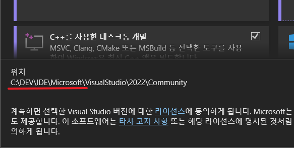

# 🧠 Visual Studio 설치

### 최신 버전


최신 버전 다운로드 링크


위의 링크에서 자신의 운영체제에 맞 최신 버전의 Visual Studio Community Edition을를 다운로드 받습니다.  Professional과 Enterprise는 상용 제품으로 회사에서 사용하려고 하면 구매를 반드시 해야 합니다.&#x20;

설치에 대한 설명은 생략합니다.

단! 설치하는 경로를 기본 경로인 Program Files 보다는 구분할 수 있는 다른 경로를 사용하기를 추천합니다.

<figure><figcaption>
DEV는 개발을 위한 툴을 위한 경로입니다
</figcaption></figure>

C:\DEV 라는 경로 아래에 언어설치는 Langs라는 폴더아래에 개발툴은 IDE 폴더 아래에 설치합니다.

